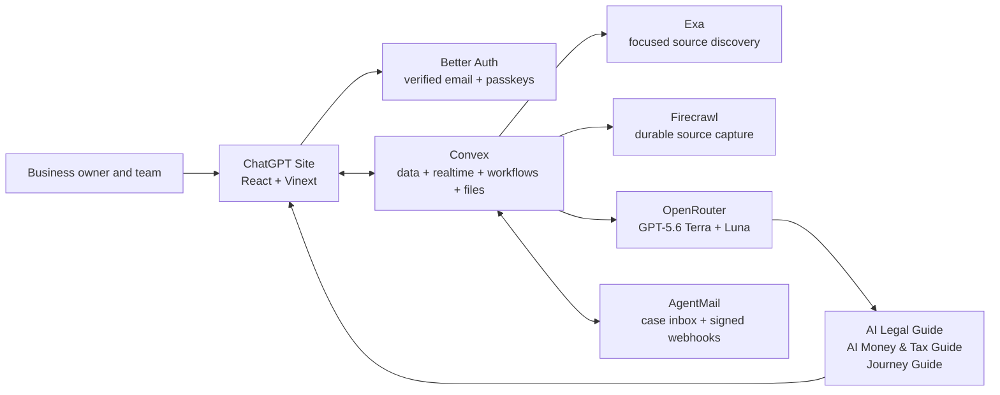

<div align="center">
  
  <h1>RibbonDesk</h1>
  <p><strong>Open right. Stay ready.</strong></p>
  <p>An evidence-backed AI guide that builds and walks an owner through a personal business-opening route, one clear step at a time.</p>

  <p>
    <a href="https://ribbondesk.souravberaakagralius.chatgpt.site"><strong>Open the live app</strong></a>
    ·
    <a href="./hackathon.md">Build log</a>
    ·
    <a href="./CONTRIBUTING.md">Contributing</a>
  </p>

  <p>
    <a href="https://github.com/SouravBeraAkaSpeed/RibbonDesk/actions/workflows/ci.yml"></a>
    <a href="./LICENSE"></a>
    
    
  </p>
</div>


## What RibbonDesk does

RibbonDesk helps a first-time owner understand what to do to open a business and
keep it running. The owner answers ordinary questions; RibbonDesk searches live
sources, saves authoritative evidence, runs dedicated AI legal and money-and-tax
checks, and builds a personal route in the right order. The product then keeps
the current step, its explanation, official portal, files, messages, and AI guide
together.

NYC cafés and restaurants have the first maintained source library, but they are
not the product limit. Any business and location can start live Exa and Firecrawl
research. Only official evidence can create a must-do step. A missing or
conflicting fact becomes one simple question instead of a guessed answer.

RibbonDesk provides AI guidance based on cited public information. It is not a
law firm, accounting firm, or government agency. It does not file, pay, sign,
attest, impersonate an owner, or store third-party portal credentials.

## A complete owner journey

1. **Create a verified account.** Use email/password with an AgentMail
   confirmation link. After sign-in, add a device passkey for
   passwordless access.
2. **Create a protected workspace.** Name the organization, business, and first location.
3. **Describe the real operation in plain language.** Add the address and activities, then answer “Will your business do any of these things?” with Yes, No, or Not sure.
4. **Confirm where the business operates.** RibbonDesk shows the city, state or region, and country it will use before research begins.
5. **Let the live research run.** Exa discovers relevant sources, Firecrawl stores authoritative pages, GPT-5.6 Terra performs legal and money-and-tax reviews, and GPT-5.6 Luna sequences the journey. Progress updates live and survives leaving the page.
6. **Follow the ready-made route.** Steps are grouped into Must do before opening, Smart to consider, and After opening. Each explains the action, reason, time, cost, preparation, and evidence.
7. **Complete one outside action with the guide beside it.** An official route appears first. Sites that permit framing open beside the step; blocked or login-protected sites open directly without losing progress.
8. **Ask for help in context.** The Journey Guide, AI Legal Guide, or AI Money & Tax Guide answers from that step and its sources. Markdown is rendered safely instead of exposed as syntax.
9. **Share only what you choose.** With explicit browser permission, preview and confirm a portal screenshot before the Journey Guide sees it; PNG/JPEG upload is the fallback. Banking screens are never accepted.
10. **Keep proof and communication connected.** Attach a receipt or approval to the step. An optional AgentMail inbox links government correspondence and approval-gated drafts to the same work.
11. **Coordinate in realtime.** Invite teammates as owner, admin, contributor, or viewer; search existing records; and see route changes across connected sessions.
12. **Continue after opening.** Confirm that the business is operating to unlock renewals, annual filings, inspections, notices, expirations, and recurring work on the same journey.
13. **Retain control of the data.** Export the organization record or queue permanent deletion of app records, stored files, scheduled work, and the remote case inbox.

## Product capabilities

The primary authenticated experience is the guided journey, not a module
dashboard. `/app` shows the current action, `/app/step/[stepId]` keeps the guide
and portal companion beside that action, and `/app/roadmap` provides a compact
preview of what comes next. Messages, files, team, and settings live under More.

| Area                   | What users can do                                                                                          |
| ---------------------- | ---------------------------------------------------------------------------------------------------------- |
| Journey                | See one current action, progress, reason, expected time/cost, preparation list, and evidence               |
| Live research          | Watch durable Exa discovery, Firecrawl capture, specialist checks, and route building update in realtime   |
| Portal companion       | Open safe embeddable sources beside the guide or use a secure direct-window fallback                       |
| AI specialist guides   | Ask legal, money-and-tax, or general journey questions grounded in the step’s saved citations              |
| Proof and applications | Attach private proof to a step, reuse application answers, prepare packets, and record external outcomes   |
| Case inbox             | Provision an inbox, receive signed webhooks, connect threads to steps, and approve every outbound delivery |
| After-opening route    | Continue through renewals, recurring filings, inspections, notices, expirations, and reminders             |
| Team                   | Invite members and enforce owner, admin, contributor, and viewer boundaries server-side                    |
| Data controls          | Search, receive notifications, export the organization, and permanently delete it                          |

## Trust model

- **Only evidence creates must-do work.** Professional references can explain; commercial pages can offer paid help; only official sources support required steps.
- **AI guides, owners act.** The guides perform research and checking, while owners deliberately click every filing, payment, attestation, destructive action, and external send.
- **Evidence stays attached.** Each journey step preserves source tier, URL, capture date, excerpt, model/prompt trace, and the reason it applies.
- **Uncertainty becomes one question.** Missing or conflicting evidence cannot silently produce a confident conclusion.
- **Authorization lives on the server.** Every protected Convex operation checks the authenticated user, organization membership, and role.
- **External content is untrusted.** Pages, documents, and email are isolated from system instructions and rendered through safe readers.
- **Secrets stay server-side.** Only public Site and Convex URLs reach the browser.

Read the full [security policy](SECURITY.md) and the plain-language live
[disclaimer](https://ribbondesk.souravberaakagralius.chatgpt.site/disclaimer).

## Architecture



RibbonDesk uses ChatGPT Sites/Vinext, React 19, strict TypeScript, Tailwind and
shadcn for the product surface. Convex is the single backend for data, realtime
queries, server functions, HTTP callbacks, scheduled work, durable components,
and file storage. Better Auth provides verified email/password, sessions,
password reset, and authenticated passkey enrollment. Social providers are not
exposed by the public release.
AgentMail delivers security mail through a bounded Convex retry queue. Exa finds
focused current sources, Firecrawl saves durable evidence, OpenRouter serves
OpenAI GPT-5.6 Terra and Luna for specialist checks and plain-language route
building, and AgentMail provides case inboxes and delivery events.

See [Architecture](docs/ARCHITECTURE.md) for domains, workflows, authorization,
provider boundaries, and failure behavior. [Authentication operations](docs/AUTHENTICATION.md)
documents the public authentication policy and private judge-account procedure.

## Local development

### Requirements

- Node.js 22.13 or newer
- npm
- A Convex account and deployment
- Google Chrome or Microsoft Edge for the complete authentication smoke test
- Optional Firecrawl, OpenRouter, and AgentMail credentials for live provider verification

```powershell
git clone https://github.com/SouravBeraAkaSpeed/RibbonDesk.git
cd RibbonDesk
npm install
Copy-Item .env.example .env.local
npx convex dev
npm run dev
```

Open `http://localhost:3000`. Keep provider secrets in the Convex deployment
environment, not `.env.local`. The client receives only public URLs.

Required production values:

- `OPENROUTER_API_KEY`
- `EXA_API_KEY`
- `FIRECRAWL_API_KEY`
- `AGENTMAIL_API_KEY`
- `AGENTMAIL_WEBHOOK_SECRET`
- `AUTH_EMAIL_INBOX_ID`
- `BETTER_AUTH_SECRET`
- `GOOGLE_CLIENT_ID` and `GOOGLE_CLIENT_SECRET` only for maintainer-controlled
  OAuth testing; the public release renders no social-login control
- `RIBBONDESK_PROVIDER_MODE=live`
- `SITE_URL`, `CONVEX_SITE_URL`, and the public client URLs documented in `.env.example`

Provider/model URLs and Firecrawl webhook values are optional overrides. See
[Deployment](docs/DEPLOYMENT.md) for the safe promotion order.

## Verification

```powershell
npx convex dev --once
npm run typecheck
npm run lint
npm run test:unit
npm run test:auth
npm run build
npm audit --omit=dev
```

Public releases use `npm run build:production` with explicit production Site
and Convex URLs; see [Deployment](docs/DEPLOYMENT.md). This prevents a local
development backend URL from being baked into a public browser bundle.

The authentication check proves verified email registration, password sign-in,
authenticated passkey enrollment/sign-in, password reset, absence of public
social-login controls, and controlled cleanup. Controlled live-provider checks create uniquely named workspaces and resources,
prove the real workflow, and remove their test data:

```powershell
npm run test:live-research
npm run test:live-agentmail
```

CI runs installation, strict type checking, lint, unit tests, and the production
build on every push and pull request.

## Repository map

```text
app/                      Public pages and authenticated product surfaces
components/               Shared interface and provider components
convex/                   Schema, auth, functions, workflows, webhooks, and crons
lib/                      Shared client and domain helpers
scripts/                  Controlled browser and live-provider acceptance tests
tests/                    Domain and authorization-focused unit tests
public/                   Brand, social preview, and original 3D artwork
docs/                     Architecture and deployment operations
hackathon.md              First-person, evidence-backed build history
HACKATHON_REQUIREMENTS.md Event requirements and readiness evidence
```

## Project governance

- [Contributing guide](CONTRIBUTING.md)
- [Code of Conduct](CODE_OF_CONDUCT.md)
- [Security policy](SECURITY.md)
- [MIT License](LICENSE)

## Author

**Saurabh Bera**<br />
Head of Tech at Quark Labs · Previously CEO of Dot Labs

Built for the [Convex All Gas, No Brakes Hackathon](https://www.convex.dev/hackathons/all-gas).

---

<div align="center"><strong>From red tape to ribbon cutting—and every renewal after.</strong></div>
