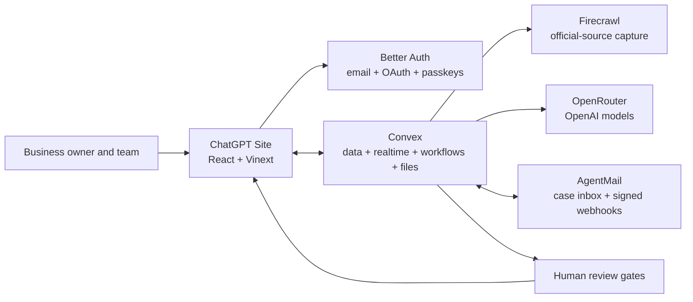

<div align="center">
  
  <h1>RibbonDesk</h1>
  <p><strong>Open right. Stay ready.</strong></p>
  <p>One live desk for official-source research, requirements, tasks, evidence, agency email, applications, inspections, and renewals.</p>

  <p>
    <a href="https://ribbondesk.souravberaakagralius.chatgpt.site"><strong>Open the live app</strong></a>
    ·
    <a href="./hackathon.md">Build log</a>
    ·
    <a href="./CONTRIBUTING.md">Contributing</a>
  </p>

  <p>
    <a href="https://github.com/SouravBeraAkaSpeed/RibbonDesk/actions/workflows/ci.yml"></a>
    <a href="./LICENSE"></a>
    
    
  </p>
</div>


## What RibbonDesk does

RibbonDesk helps a local business owner understand what must be done to open a
business and keep it running. The owner describes the business and its location;
RibbonDesk researches official sources, proposes a cited plan for human review,
organizes the work, turns agency email into reviewed follow-up actions, and keeps
renewals and inspections visible after opening.

NYC cafés and restaurants are the first verified coverage pack. Any business in
any location can run dynamic official-source research. Unsupported, uncertain,
or conflicting results stay visibly marked for review rather than being
presented as settled guidance.

RibbonDesk is an information organizer and work tracker, not a law firm or a
government filing service. It prepares and tracks applications; it does not
submit them or make legal decisions for the owner.

## A complete owner journey

1. **Create a verified account.** Use email/password with an AgentMail
   confirmation link, Google, or Apple. After sign-in, add a device passkey for
   passwordless access.
2. **Create a protected workspace.** Name the organization, business, and first location.
3. **Describe the real operation.** Add the address, business type, activities, and triggers such as food service, alcohol, seating, employees, construction, delivery, or signage.
4. **Confirm the jurisdiction.** RibbonDesk detects a likely jurisdiction but requires the owner to confirm it.
5. **Approve source research.** The owner sees the trusted domains and starts a live Firecrawl run.
6. **Review cited proposals.** OpenRouter models extract possible permits, registrations, inspections, fees, dependencies, deadlines, and open questions. Every proposal keeps its source evidence and confidence.
7. **Keep people in control.** The owner accepts, edits, rejects, or marks each proposal not applicable. AI output never silently becomes a requirement.
8. **Run the opening plan.** Confirmed requirements become assignable tasks with deadlines, blockers, dependencies, status, notes, and evidence.
9. **Prepare applications.** Reuse business answers, track attachments, inspect readiness, follow the official portal link, and record an external submission receipt and outcome.
10. **Work from one case inbox.** Provision a location-owned AgentMail inbox, receive agency mail, review the AI summary and proposed changes, edit a reply, and require owner/admin approval before it is sent.
11. **Coordinate in realtime.** Invite teammates as owner, admin, contributor, or viewer; assign work; search the workspace; and see changes in another browser immediately.
12. **Stay ready after opening.** Move the location to operating mode and track renewals, inspections, notices, document expirations, corrective actions, reminders, and meaningful source changes.
13. **Retain control of the data.** Export the organization record or queue permanent deletion of app records, stored files, scheduled work, and the remote case inbox.

## Product capabilities

The authenticated desk is divided into URL-backed workspaces for Today, Plan &
research, Inbox, Documents, Operations, Assistant, Team, and Settings. Sidebar,
mobile navigation, browser history, reloads, and shared links all preserve the
active workspace instead of scrolling through one oversized dashboard.

| Area                     | What users can do                                                                                                          |
| ------------------------ | -------------------------------------------------------------------------------------------------------------------------- |
| Today                    | See overdue, blocking, waiting-on-agency, upcoming, and informational work in priority order                               |
| Research                 | Run durable official-source capture, watch progress live, inspect safe source snapshots, and recover partial/failed runs   |
| Requirements             | Review cited AI proposals, resolve conflicts, manage dependencies, assign owners, and confirm statuses                     |
| Tasks and evidence       | Create work, attach private files, link evidence, set expirations, and track completion in realtime                        |
| Applications             | Collect reusable answers, track attachments and readiness, use official portal links, and record external outcomes         |
| Case inbox               | Provision an inbox, receive signed webhooks, link threads to work, approve proposed updates, and approve outbound delivery |
| Inspections and renewals | Record outcomes, corrective actions, recurrence, reminders, and future deadlines                                           |
| Ribbon Assistant         | Ask grounded questions about the current workspace and receive cited, proposal-only help                                   |
| Team                     | Invite members and enforce owner, admin, contributor, and viewer boundaries server-side                                    |
| Data controls            | Search, receive notifications, export the organization, and permanently delete it                                          |

## Trust model

- **People confirm consequential changes.** AI proposes; owners and admins approve requirements, deadline changes, and external email.
- **Evidence stays attached.** Confirmed requirements preserve the source URL, agency, capture date, excerpt, confidence, and verification state.
- **Uncertainty stays visible.** Missing, conflicting, nonofficial, or truncated guidance becomes a review item.
- **Authorization lives on the server.** Every protected Convex operation checks the authenticated user, organization membership, and role.
- **External content is untrusted.** Pages, documents, and email are isolated from system instructions and rendered through safe readers.
- **Secrets stay server-side.** Only public Site and Convex URLs reach the browser.

Read the full [security policy](SECURITY.md) and the plain-language live
[disclaimer](https://ribbondesk.souravberaakagralius.chatgpt.site/disclaimer).

## Architecture



RibbonDesk uses ChatGPT Sites/Vinext, React 19, strict TypeScript, Tailwind and
shadcn for the product surface. Convex is the single backend for data, realtime
queries, server functions, HTTP callbacks, scheduled work, durable components,
and file storage. Better Auth provides verified email/password, Google and
Apple OAuth, sessions, password reset, and authenticated passkey enrollment.
AgentMail delivers security mail through a bounded Convex retry queue. Firecrawl captures official
sources, OpenRouter serves OpenAI models for structured extraction and grounded
assistance, and AgentMail provides case inboxes and delivery events.

See [Architecture](docs/ARCHITECTURE.md) for domains, workflows, authorization,
provider boundaries, and failure behavior. [Authentication operations](docs/AUTHENTICATION.md)
contains the exact Google and Apple console configuration and production callback URLs.

## Local development

### Requirements

- Node.js 22.13 or newer
- npm
- A Convex account and deployment
- Google Chrome or Microsoft Edge for the complete authentication smoke test
- Optional Firecrawl, OpenRouter, and AgentMail credentials for live provider verification

```powershell
git clone https://github.com/SouravBeraAkaSpeed/RibbonDesk.git
cd RibbonDesk
npm install
Copy-Item .env.example .env.local
npx convex dev
npm run dev
```

Open `http://localhost:3000`. Keep provider secrets in the Convex deployment
environment, not `.env.local`. The client receives only public URLs.

Required production values:

- `OPENROUTER_API_KEY`
- `FIRECRAWL_API_KEY`
- `AGENTMAIL_API_KEY`
- `AGENTMAIL_WEBHOOK_SECRET`
- `AUTH_EMAIL_INBOX_ID`
- `BETTER_AUTH_SECRET`
- `GOOGLE_CLIENT_ID` and `GOOGLE_CLIENT_SECRET` for Google sign-in
- `APPLE_CLIENT_ID` and `APPLE_CLIENT_SECRET` for Apple sign-in
- `RIBBONDESK_PROVIDER_MODE=live`
- `SITE_URL`, `CONVEX_SITE_URL`, and the public client URLs documented in `.env.example`

Provider/model URLs and Firecrawl webhook values are optional overrides. See
[Deployment](docs/DEPLOYMENT.md) for the safe promotion order.

## Verification

```powershell
npx convex dev --once
npm run typecheck
npm run lint
npm run test:unit
npm run test:auth
npm run build
npm audit --omit=dev
```

Public releases use `npm run build:production` with explicit production Site
and Convex URLs; see [Deployment](docs/DEPLOYMENT.md). This prevents a local
development backend URL from being baked into a public browser bundle.

The authentication check proves verified email registration, password sign-in,
authenticated passkey enrollment/sign-in, password reset, provider controls,
and controlled cleanup. Controlled live-provider checks create uniquely named workspaces and resources,
prove the real workflow, and remove their test data:

```powershell
npm run test:live-research
npm run test:live-agentmail
```

CI runs installation, strict type checking, lint, unit tests, and the production
build on every push and pull request.

## Repository map

```text
app/                      Public pages and authenticated product surfaces
components/               Shared interface and provider components
convex/                   Schema, auth, functions, workflows, webhooks, and crons
lib/                      Shared client and domain helpers
scripts/                  Controlled browser and live-provider acceptance tests
tests/                    Domain and authorization-focused unit tests
public/                   Brand, social preview, and original 3D artwork
docs/                     Architecture and deployment operations
hackathon.md              First-person, evidence-backed build history
HACKATHON_REQUIREMENTS.md Event requirements and readiness evidence
```

## Project governance

- [Contributing guide](CONTRIBUTING.md)
- [Code of Conduct](CODE_OF_CONDUCT.md)
- [Security policy](SECURITY.md)
- [MIT License](LICENSE)

## Author

**Saurabh Bera**<br />
Head of Tech at Quark Labs · Previously CEO of Dot Labs

Built for the [Convex All Gas, No Brakes Hackathon](https://www.convex.dev/hackathons/all-gas).

---

<div align="center"><strong>From red tape to ribbon cutting—and every renewal after.</strong></div>
